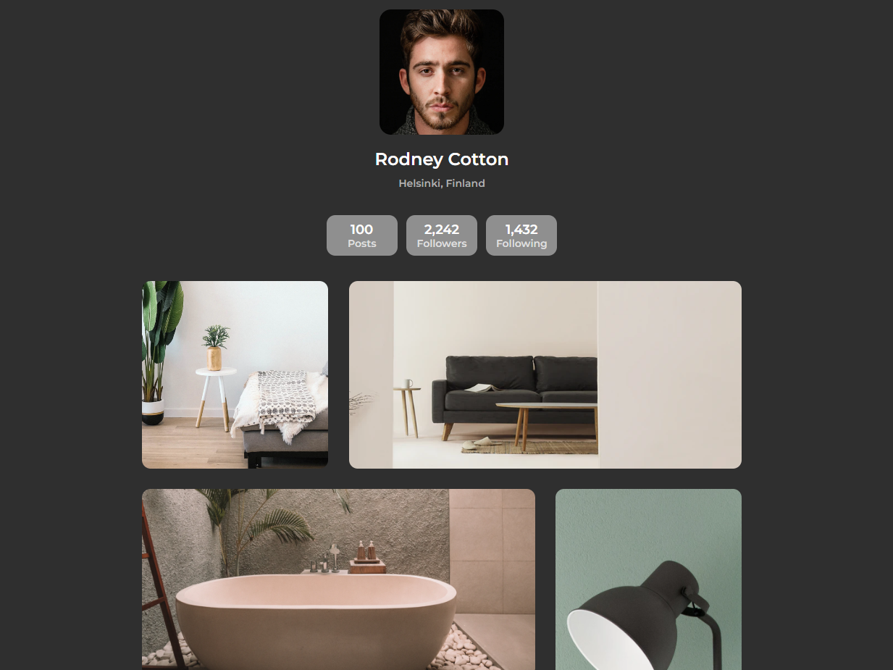
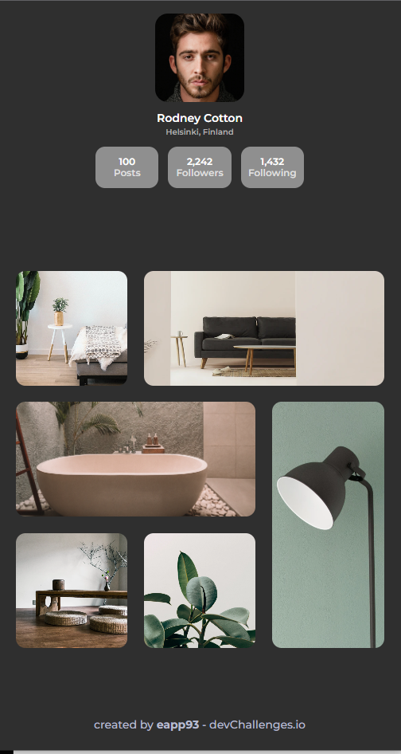

<h1 align="center">My gallery</h1>

   Solution for a challenge from  <a href="http://devchallenges.io" target="_blank">Devchallenges.io</a>.

  <h3>
    <a href="https://chipper-bienenstitch-fc1bfb.netlify.app">
      Demo
    </a>
     | 
    <a href="https://github.com/EAPP93/devchallenges__my-gallery.git">
      Solution
    </a>
     | 
    <a href="https://legacy.devchallenges.io/challenges/gcbWLxG6wdennelX7b8I">
      Challenge
    </a>
  </h3>

## Overview
### important
To use the dark mode you have to have your computer or browser configured in dark mode to show this is because the challenge did not require dark mode and I did not want to break the design

  <h2>Desktop</h2>
  

    
  

  <h2>Mobile</h2>
  

    
  

### Built With

- HTML
- CSS
## Features

This application/site was created as a submission to a [DevChallenges](https://devchallenges.io/challenges) challenge. The [challenge](https://devchallenges.io/challenges/gcbWLxG6wdennelX7b8I) was to build an application to complete the given user stories.

## Contact

- Website [eapp.dev](https://eapp.dev)
- GitHub [@eapp93](https://github.com/eapp93)
